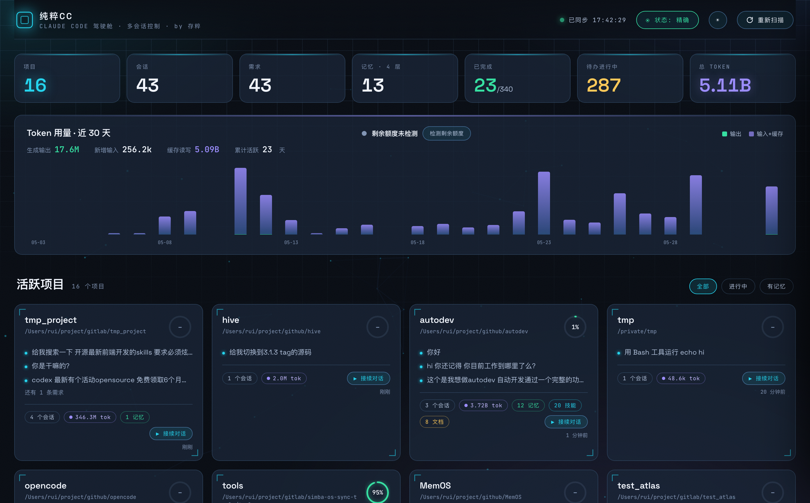

<div align="center">

[中文](./README.md) · **English**

# ChunCui CC · 纯粹CC

**A multi-session mission-control cockpit for Claude Code — steer all your sessions from one screen**

`live dashboard` · `parallel real terminals` · `traffic-light status` · `4-layer memory` · `project docs` · `token / quota` · `macOS app`

<sub>made with ◢◤ by <b>存粹 (ChunCui)</b></sub>

<br><br>



</div>

---

## ✨ What is it

You run Claude Code across many repos and lose track of *which task lives where and how far it got*.

**纯粹CC (ChunCui CC)** scans your local `~/.claude` in real time and turns it into a **sci-fi HUD cockpit**: requirements, progress, memory, skills, docs and token usage per project — plus **multiple real terminal windows** driving Claude Code in parallel, each with a **traffic light** telling you whether it's working, waiting for you, or idle.

## 🚀 Features

| | Feature | Details |
|---|---|---|
| 🛰 | **Project overview** | Scans `~/.claude/projects`, resolves each real path, sorted by recent activity |
| 📋 | **Requirements** | The first message of each session = the requirement you asked for |
| 📊 | **Drill-down progress** | Merges TodoWrite tasks **and** superpowers `specs/` checkboxes, ring + detail |
| 🧠 | **4-layer memory** | `user / feedback / project / reference`, grouped |
| 🛠 | **Skills** | Project-local `.claude/skills` + global skills, with descriptions |
| 📄 | **Project docs** | Markdown in `specs/ docs/ plans/`, read in a floating window |
| 🔢 | **Token & quota** | Per-session / per-project / global usage + 30-day chart + live remaining % scraped from `/usage` |
| 🖥 | **Parallel real terminals** | A real interactive `claude` per session (PTY + xterm) — drag / resize / minimize / pop-out |
| 🚦 | **Traffic-light status** | 🔴 busy / 🟡 waiting-for-you / 🟢 idle, visible even when minimized |
| 🍎 | **macOS app** | Native Electron windows; sessions detach and move to any monitor |

## 📦 Install & Run

Requires **Node.js ≥ 18** and the **`claude` CLI** installed & logged in.

```bash
git clone https://github.com/dengmingrui/helm-cc.git
cd helm-cc
npm install            # node-pty (native) + ws + electron
```

**A. Browser mode**
```bash
npm start              # = node server.js, open http://localhost:4317
```

**B. macOS desktop app**
```bash
npm run app            # native window; sessions open as detached windows
```

Or grab the prebuilt `.dmg` from [Releases](https://github.com/dengmingrui/helm-cc/releases) (Apple Silicon only).

Port: `PORT=8080 npm start` ｜ claude path: `CLAUDE_BIN=/opt/homebrew/bin/claude npm start`

> ⚠️ This launches **real** Claude Code processes that act inside your repos — start it yourself, knowingly. Everything stays local; nothing is sent off your machine.

## 🚦 Status hooks (optional)

The traffic light works out of the box via a PTY heuristic. For **authoritative** status (especially 🟡 waiting-for-you and 🟢 done), click the **状态 / Status** button in the dashboard topbar to enable it with one click (writes hooks into `~/.claude/settings.json`, auto-backed-up, reversible).

CLI: `npm run hooks` to enable / `node add-hooks.js --remove` to disable. **Never auto-installed — always requires your confirmation.**

## 🏗 Architecture

```
┌─────────────────────────────────────────────┐
│  纯粹CC dashboard (public/ · vanilla HTML/JS)  │
│  ├─ live scan of ~/.claude → /api/data        │
│  └─ click "Chat" → open a real terminal       │
└───────────────┬─────────────────────────────┘
        WebSocket │  /api/term
┌───────────────▼─────────────────────────────┐
│  server.js (Node http + ws + node-pty)        │
│  └─ runs a real interactive `claude` in a PTY │
└───────────────┬─────────────────────────────┘
        settings hooks │ POST /api/hook (session_id, event)
                       ▼  → routed to its terminal → traffic light
```

- **server.js** — Node built-in `http` + `ws` + `node-pty`; live disk scan, PTY terminals, hook receiver.
- **public/** — vanilla HTML/CSS/JS (zero framework), xterm.js vendored locally (offline-ready).
- **electron/** — desktop shell: runs the server with Node (avoids node-pty's Electron-ABI pitfall); sessions are native windows.

## 🍎 Build a `.app`

```bash
npm run dist           # electron-builder → dist/纯粹CC.dmg
```

## 🔧 Notes

- **node-pty & newer Node**: if the terminal shows `posix_spawnp failed`, rebuild from source once:
  `cd node_modules/node-pty && npx node-gyp rebuild` (needs Xcode CLT + python3).
- **Vendored xterm**: `public/vendor/` ships xterm / addon-fit / marked — no CDN, works offline.
- **Session continuity**: terminals use `--session-id` (new) / `--resume` (continue); sessions persist into `~/.claude` and reappear on the dashboard.
- **Privacy guard**: the scan skips home / Documents / Downloads / iCloud / Library and other protected roots to avoid macOS file-access prompts.

## 📁 Layout

```
server.js          live data + PTY terminals + hook receiver
add-hooks.js       one-click install/remove of status hooks (with backup)
electron/          desktop client (main.js · preload.js)
public/            dashboard + terminal page + doc page + vendored libs
```

## 📝 License

MIT · made by **存粹 (ChunCui)** · 2026
